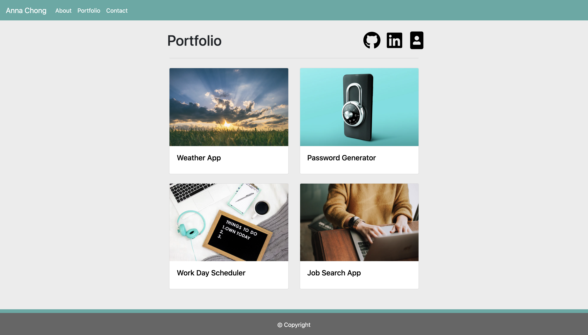

# Responsive Portfolio

## Description

A responsive website were components on the page adjust according to the screen size. 
It contains three pages which include:

- About me
- Porfolio: includes real projects coded by Anna
- Contact me

It was a fun challenge for a novice coder with no web development background undergoing an intense coding bootcamp. It pushed boundaries and forced hours of Googling, resulting in a semi-decent functional website.

Everything was possible because there was always an answer on the internet.

## Usage

## Have a look yourself

https://acho9138.github.io/HW2-Responsive-Portfolio/index.html

## Credits

Thank you to the following resources to make this website possible:

- The Coding Bootcamp at University of Sydney
- Bootstrap
- w3schools.com
- Coding Journery Youtube video for the footer: https://www.youtube.com/watch?v=US_3XvufMLU
- Font Awesome
- Unsplash